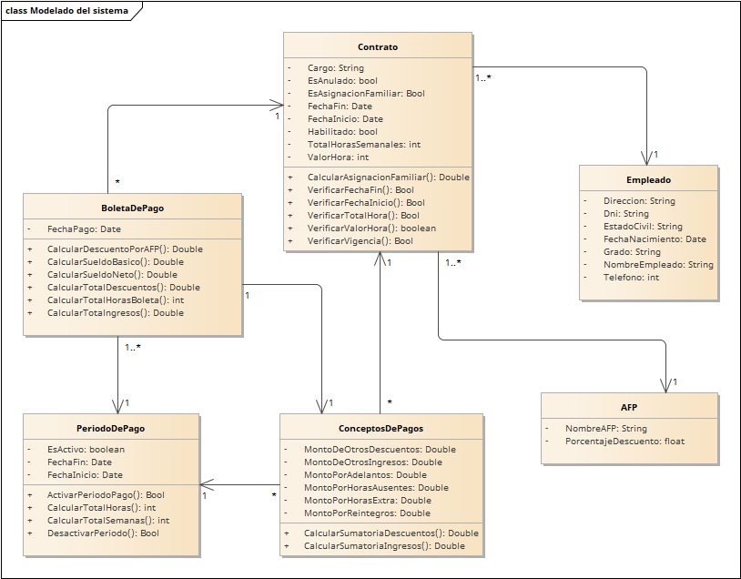
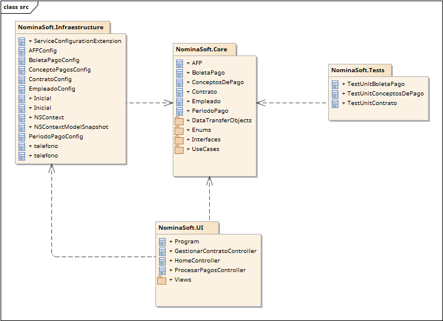

# NominaSoft ~ Proyecto de Calidad y Pruebas de Software
=======

### Integrantes del proyecto

 - Luis Sebastián Arribasplata Chávarri
 - Daniel Badinho Cornejo Chunga
 - Jose Alberto Esparza del Castillo
 - Bruno Jacobs Schulz
 - José Miguel Leython Lias
 - Loana Valeri Yañez López

### Propósito del proyecto
Desarrollar un sistema de nómina de empleados y evaluar la calidad del producto. Su alcance es sólo la implementación
de dos casos de uso: Gestionar contratos y procesar pagos.

### Objetivos del proyecto

- Diseñar las clases del dominio y la base de datos en la primera iteración **(I-1)**
- Implementar los casos de uso con pruebas unitarias en la segunda iteración **(I-2)**
- Realizar pruebas funcionales y corregir defectos en la tercera iteración **(I-3)**
- Inspeccionar y refactorizar el software en la cuarta iteración **(I-4)**
- Medir la calidad del software y elaborar un paper en la quinta iteración **(I-5)**

### Diagrama de clases

### Diagrama DDL 

### Diagrama de paquetes

### Información importante

- **Clean Architecture**
  - [A quick introduction to clean architecture](https://www.freecodecamp.org/news/a-quick-introduction-to-clean-architecture-990c014448d2/)
  - [The Clean Architecture](https://blog.cleancoder.com/uncle-bob/2012/08/13/the-clean-architecture.html)
- **GRASP**
  - [GRASP Design Principles](https://www.cs.colorado.edu/~kena/classes/5448/f12/presentation-materials/rao.pdf)
  - [GRASP - General Responsibility Assignment Software Patterns Explained](http://www.kamilgrzybek.com/design/grasp-explained/)
- **Git**
  - [git - the simple guide - no deep shit!](https://rogerdudler.github.io/git-guide/)
  - [Introducing Gitflow](https://datasift.github.io/gitflow/IntroducingGitFlow.html)
- **.NET Core**
  - [.NET Core Guide](https://docs.microsoft.com/en-us/dotnet/core/)
